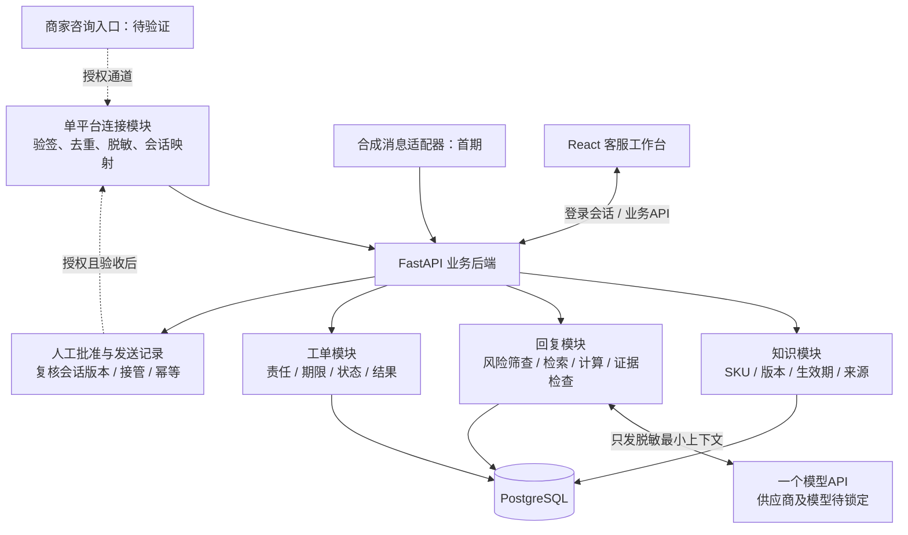

# 食品客服 Agent 开发设计 V0.5

后续实现状态见[V0.6本地开发说明](LOCAL_DEVELOPMENT_V0_6.md)：用户已要求尽量完整开发，当前新增SQLite持久化、业务后端与实际工作台。本文件保留为设计历史，不能据此判断代码仍未实现。

日期：2026-09-11。状态：开发设计及交互原型；业务后端、模型调用、数据库与平台连接尚未实现。用户本轮认可自主开发方向并要求设计稿、开发准备度和系统架构，本版将V0.4补充为可拆分的开发任务，不代表授权生产上线。

## 1. 准备度与本轮边界

此前仅有产品/商业计划和许可调研，没有应用代码、页面稿、数据库或接口设计。本版新增页面交互、架构、数据模型、接口约定与开发验收。

现在可进入：使用合成数据的内部业务核心开发。真实平台连接仍需确定具体入口、账号授权、许可、费用和测试商家；在这些条件满足前，不承诺可商用集成或自动接待。本版允许先做小规模核心验证，调整V0.4“通道前只整理规格”的内部研发顺序；预算、隐私和真实接入条件不变。先完成第一个可演示流程，复核投入后再扩展。

设计假设：桌面浏览器为主，食品/日用品单店、最多3名使用者、20个重点SKU、50条知识/规则，售前商品/活动与售后分流。购买者为老板/主管/代运营负责人，使用者为客服/售后人员。暂无真实客户、消息接入或效果数据。

## 2. 页面与交互设计

可点击原型：[index.html](../output/design-v0.5/index.html)。本地单文件，无远程资源、持久存储或模型调用；所有对话与商品为合成样例。原型状态保存在页面内存，刷新重置。它用于验证操作布局，不能证明API、数据库、模型或平台功能完成。

| 页面 | 内容和主要操作 | 空/失败/限制状态 |
| --- | --- | --- |
| 接待工作台 | 左侧会话列表，中间问题与可编辑回复草稿，右侧知识依据/待确认项；审核模拟发送、接管、重生成、工单 | 加载失败不生成臆测回复；无知识先追问/转人工；新问题使草稿失效；接管后停止AI发送 |
| 商品与知识 | SKU规格、配料、存储规则、来源和版本；知识草稿经主管发布，旧版留证据 | 缺必填项不可发布；冲突/过期不用于回复；原型仅展示固定条目及模拟发布使草稿失效 |
| 售后工单 | 从咨询生成脱敏摘要，确认责任角色、期限；待处理→处理中→待外部反馈/已关闭 | 无责任人/期限不能提交；无处理结果不能关闭；原型演示固定责任角色、期限和结果 |
| 接入设置 | 展示具体入口、状态、已验证能力与缺失条件 | 千牛/飞鸽/PDD/小红书均显示待验证，无虚假“已连接”按钮；原型只支持模拟通道 |
| 架构说明 | 面向评审的模块关系、实施顺序和状态 | 属于设计稿附页，不是未来商家日常工作页面 |

原型优先交互：商品比较→查看依据→编辑→人工确认模拟发送；生产日期缺批次→追问；食品品质/赔付问题→禁止AI发送→确认工单；人工接管、模拟新消息、知识更新分别使相关草稿不可发送。原型不展示臆造营业数据和收益百分比。

## 3. 系统架构与选型

采用模块化单体：一个Web前端、一个Python业务后端、一套PostgreSQL。知识、回复、工单为同一应用中的模块。小样本先结构化筛选和词项检索，证据不足即追问；评测证明需要后再增加语义检索。不先部署向量数据库、Redis、微服务或多Agent集群。

推荐技术：React前端、FastAPI后端、PostgreSQL数据存储。采用这些基础组件是方案选择，不代表已安装或版本已锁定。React/FastAPI当前采用MIT许可，PostgreSQL采用其宽松许可；仍需交付前锁定版本、核对所有依赖及保留必要声明。[React许可](https://github.com/react/react/blob/main/LICENSE)、[FastAPI许可](https://github.com/fastapi/fastapi/blob/master/LICENSE)、[PostgreSQL许可](https://www.postgresql.org/about/licence/)。暂不引入整套Chatwoot/Dify；此前调研保留为备选。

模型只负责意图提取、措辞和受约束的草稿，不能直接执行发送或退款。工具限定为read_knowledge、compare_sku、calculate_pack_value、propose_ticket；工具调用由后端校验输入、权限与结果，不赋予Shell、任意URL或任意SQL权限。金额计算采用十进制定点数，条件不全不计算最终优惠价。不索取或保存模型内部思维链，只记录简短依据、所用规则和工具结果。

## 4. 数据模型初稿

所有业务记录含store_id、created_at；可变实体另含version、updated_at以支持并发校验。首期一个店铺；开发测试增加第二套合成店铺防止串数据。店铺范围由服务端登录身份确定，不信任前端传入store_id。复合外键/查询同时约束店铺和对象ID。未来首批商家优先分别部署，暂不开发自助注册、多租户计费和代理商后台。

| 表/实体 | 最小字段 | 约束 |
| --- | --- | --- |
| staff | id、store_id、role、active、auth_subject | 主管/客服权限；身份由登录服务映射，不保存明文密码或会话凭据 |
| products | id、store_id、sku_code、title、structured_attributes、version | 店内sku_code唯一；属性仅保存授权商品知识 |
| knowledge_versions | id、store_id、product_id或通用范围、kind、content、source_label、valid_from/to、version、status、published_by | 发布版本不可覆盖；修改创建新版本；通用与商品知识冲突须人工处理 |
| conversations | id、store_id、channel、opaque_ref、revision、control_mode、control_revision | 仅内部不透明引用；每条新消息/接管改变版本；原始平台映射留在获授权连接端 |
| messages | id、store_id、conversation_id、event_ref、direction、redacted_text、received_at | 同通道事件唯一；仅合成或通过脱敏的内容 |
| drafts | id、store_id、conversation_id、message_revision、control_revision、knowledge_snapshot、text、evidence、risk_code、state、content_hash | 绑定消息/控制/知识版本；编辑产生新版本；批准针对精确文本 |
| send_attempts | id、store_id、draft_id、approval_actor、approved_hash、idempotency_key、status、channel_receipt、timestamp | 同一次批准唯一发送任务；确认动作与落库在一个事务内 |
| tickets | id、store_id、conversation_id、draft_ref、summary、category、owner_role、due_at、state、resolution | 摘要脱敏；重复点击不重复建单；关闭必须有结果 |
| audit_events | id、store_id、actor_ref、action、object_ref、versions、timestamp、outcome | 只存必要元数据；不保存原始提示词/聊天、密钥或完整请求体 |

首期商品/知识通过固定模板导入，预览校验后发布，不承诺任意PDF自动可靠解析。来源必须可由客服查看，批次生产日期不能当作整个SKU的永久属性。生产数据留存周期和删除流程在真实试点前与商家确定；当前只用合成数据。

## 5. 接口约定与状态机

这些是设计契约，尚未提供可运行服务。JSON响应统一含request_id、data或error_code；对象不存在/无权限不得泄漏其他店信息。写操作验证身份角色；确认发送/建单需要幂等键。客户端会话以安全Cookie方式承载时，实施CSRF防护、HTTPS及合理失效；认证配置在部署时托管，不写入项目文件。

| API草案 | 输入/响应重点 | 权限与校验 |
| --- | --- | --- |
| POST /api/demo/events | 固定scenario_id；返回conversation_id、revision | 仅内部合成模式，生产禁用 |
| POST /internal/channels/{channel}/events | event_ref、opaque_conversation_ref、redacted_text、occurred_at | 连接端鉴权/验签、防重放；不开放任意未脱敏输入 |
| GET /api/conversations/{id} | 脱敏消息、revision、control_mode | 仅本店 |
| POST /api/conversations/{id}/drafts | expected_revision；返回草稿、依据、缺失项、风险与状态 | 知识/模型失败返回可解释错误，不自行发送 |
| PATCH /api/drafts/{id} | text、expected_version | 修改后原批准失效；再次风险检查 |
| POST /api/drafts/{id}/approve-send | expected_message_revision、expected_control_revision、expected_draft_version、content_hash、idempotency_key | 服务器重新校验，不信任前端按钮；冲突409，风险阻断422，越权403 |
| POST /api/conversations/{id}/control | mode=human/assist、expected_control_revision | human立即停AI发送；明确释放才回assist |
| POST /api/knowledge/import-preview | 固定商品/规则模板 | 主管；不持久保存含禁存信息的原文件 |
| POST /api/knowledge/{id}/publish | expected_version | 主管；更新知识快照版本并使相关草稿失效 |
| POST /api/tickets | conversation_id、redacted_summary、owner_role、due_at、idempotency_key | 人工确认；本店引用且必填项齐全 |
| PATCH /api/tickets/{id} | expected_version、state、resolution | 关闭必填结果；并发冲突409 |
| GET /api/channels/status | 入口、权限状态、收发/接管能力、最后验证时间 | 不返回凭据或伪造已连接状态 |

草稿状态：generating→reviewable/needs_clarification/blocked/failed；新消息、人工接管或相关知识更新→stale。needs_clarification只能批准经校验的追问文本，不能夹带未知结论。blocked交人工处理，首版不从AI面板绕过风险直接发送。

发送状态：approval_pending→queued→platform_accepted/failed/unknown；delivered仅在通道提供真实送达证据时出现。草稿批准与任务创建使用数据库事务；发送前再次核对最新消息/接管/知识版本。模型请求不占用数据库长事务。任务通过数据库发送记录恢复，不引入单独消息队列。

对平台无法支持的原子发送/接管竞态，明确不能撤回已接受回复：记录时间及状态，提示客服处理；不得承诺绝无抢答。超时unknown不盲重试，优先查询平台结果；没有查询能力则交人工确认。仅对明确未提交的失败按通道条件重试，不声称端到端exactly-once。

## 6. 风险、隐私与运行设计

可自动生成草稿：知识完整、未过期的规格、存储说明和明确活动解释。首版所有对外发送均经人工确认。必须转人工：退款赔付、投诉、食品安全、医疗/功效、敏感信息修改、金额承诺，以及知识冲突/未知。用户对话与导入文档均视为业务数据，不能改变系统权限或执行规则。

生产连接端必须在持久化、日志和模型调用之前完成脱敏；不能仅靠“模型会忽略手机号”。首期仅接受合成数据，正式接入前验证连接端原文处理范围及默认日志；无法满足项目规则则不接该路径。平台Cookie、Token、模型Key不进代码、设计稿、对话或日志，运行时由客户/部署环境的安全配置提供。

本地开发：前端、后端、开发数据库，默认模拟通道和固定模型桩；接真实模型时另标注模型/配置和评测结果。试点部署：每商家一套应用/数据库，HTTPS、登录鉴权、数据库备份与恢复验证、健康检查、停止发送开关、脱敏审计。开发库不能复用其他业务项目数据库。未完成这些条件前不公开服务。

### 独立资源约束（2026-09-11补充）

用户提示：如果9月15日离开，之后将没有当前PostgreSQL可用。暂按现有数据库使用权可能终止理解，不假定离开日期已确定，也不假定当前电脑属于个人。方案从开发起就不依赖公司数据库、服务器、账号或内部商品数据。

PostgreSQL是可自行部署的数据库软件，不是必须续用的公司实例。开发计划保持PostgreSQL选型，在用户能够持续使用的个人设备上创建本项目独立实例和空库，仅导入合成样例；不导出、迁移或连接公司数据库。当前交互原型不需要数据库，可以继续查看。若设备也需归还，应先落实可用个人开发设备，再安装环境。

数据库软件本身无需许可费用，可用于商业用途并遵守许可声明要求；设备、云服务器、托管、备份及维护成本另算。[官方许可](https://www.postgresql.org/about/licence/)、[官方macOS安装方式](https://www.postgresql.org/download/macosx/)。开发先本地运行，有付费试点后再按预算部署至个人/业务独立云资源或客户授权环境；本机开发不能代替客户全天在线运行。本轮仅明确设计，未安装数据库、购买服务器或迁移数据。

成本只记录请求计数、模型用量、耗时和人工维护工时，不采集原文作统计；模型用量上限/超时后交人工。首期不做充值支付，按实施+月维护服务报价。连接器费用未知则不可给包含无限平台调用的固定价。

## 7. 开发顺序与验收

以下为工程估时假设，需第一阶段后修正，不含平台审核等待和客户资料整理。每周10–20小时，全部核心约55–85小时；不将设计稿完成写成软件已经完成。

| 阶段 | 开发任务 | 完成标准 | 初估 |
| --- | --- | --- | --- |
| A 最小完整流程 | 合成消息、模板知识、检索规则、固定模型桩、审核与模拟发送 | 商品比较有来源；无批次只追问；风险阻断；新消息旧稿不可发 | 12–18小时 |
| B 数据和模型 | 数据模型、知识发布/失效、一个模型API、账号角色 | 实际模型与桩分开标记；隔离/越权/知识冲突测试通过 | 18–28小时 |
| C 工单和恢复 | 建单/分配/关闭、幂等、发送状态与失败恢复 | 不重复建单/发信；未知发送结果不盲重试；工单可追责 | 12–18小时 |
| D 集成前质量 | 100题评测、权限回归、界面与成本复盘、试点部署准备 | 常规≥95%，风险全部符合预期；无串店；恢复与停用可验证 | 13–21小时 |
| E 一个真实通道 | 获授权测试会话收发、人工接管和异常联调 | 有真实平台证据，不用模拟成功替代；权限/费用/数据条件齐全 | 通道确定后另估 |

阶段A后设置研发复核点：若仍未找到同类痛点及具体平台路径，只保留演示并继续客户验证，不自动投入B–E。现金上限沿用首单前2,000元、三个月10,000元；不能因开发开始就默许无限投入。

业务验收沿用V0.3：100道独立题（60常规、20复杂/缺失、20风险/越权），知识更新后回归；平台100条测试消息及24小时测试观察与业务题评测分开。实际价值需至少100次适用咨询，计入审核、编辑、切窗和返工，净时间下降20%为目标，不能将前端点击演示当作效果验证。

当前可交付：本设计文档和可点击原型。当前仍缺：实际模型/版本和依赖锁定、真实平台授权及测试商家、工程实现与上线验收。下一项具体开发任务是阶段A，模拟通道下完成可验证的业务流程。
