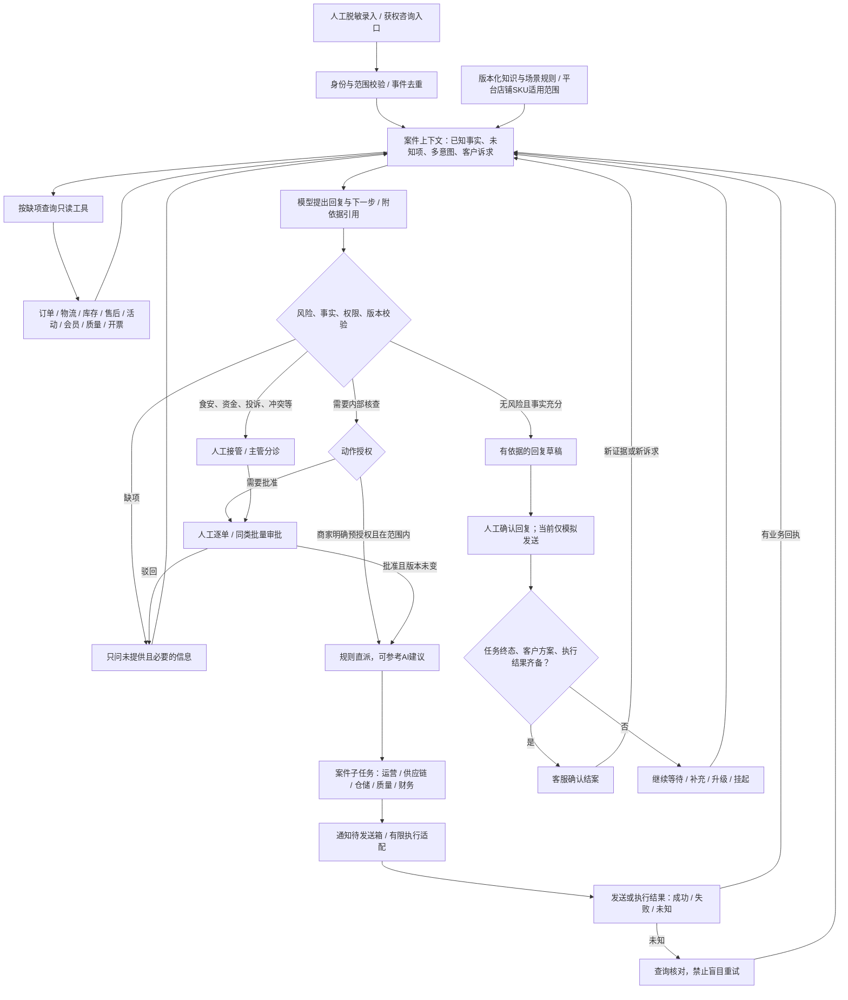

# 全场景售后 Agent 架构 V1.4

日期：2026-09-14。状态：P0规则登记、场景案件、缺项/风险分流和质量角色已实现；真实连接器、商家规则确认、部门任务拆分和执行回执仍为后续范围。

## 目标、来源与范围

目标用户：食品、酒水饮料、家清个护商家的一线客服、客服主管及运营、供应链、仓储物流、财务、质量负责人。购买者需要验证的是处理效率、减少漏单和错误承诺，以及持续维护成本。

来源为用户提供的《售后场景流程最终版.xlsx》“售后问题汇总”，218个二级场景、1969个阶段行。原场景逐项保留，矩阵中原表坐标可回查；员工信息、客户问题例句和话术全文没有进入交付文件。文件内业务要求视为待评审资料，不是执行授权。

交付入口：`output/planning-v1.4/index.html`。完整矩阵：同目录 CSV 与 JSON。CSV 的“建议”列属于设计判断；输入关键词提取只是可追溯初筛，不是已批准的必填字段清单。原表没有工单量、处理耗时、确认的权限矩阵和各系统接口字段，因此不能推算发生频率或直接按模板赔付。

十个业务域按含义归类，晚追加的质量、活动、会员等场景回归对应域；不是沿用原表尾部全部归为长尾的粗分法。多意图可有多个标签，统计时每个原场景只计一个主业务域。

## 架构原则

采用现有 React / FastAPI 单体应用，保留 SQLite 开发持久化，PostgreSQL迁移单独验证。无需先部署微服务、消息集群或218个Agent。已有模块可继续使用，新增领域规则和连接器在内部模块隔离。

知识库保存有效规则和依据；实时状态由业务工具查询；模型负责提出分类、缺项、回复和动作建议；代码核对事实、权限与状态；执行层负责回执与幂等。路由和网关都是产品内部组件，面向用户的产品是全场景售后处理与部门协作。

上图是共用机制，不要求所有咨询走完所有节点。知识咨询可以短路到回复；物流核查可以无需资金审批；食安应立即接人，不能等待客户补齐证据才分派。一个案件可并行发给质量和仓储，资金执行则等待审批与消费者方案确认；多个部门任务完成不自动等于客户问题解决。

## 上下文与规则

上下文至少包括：店铺/渠道引用、会话/案件/商品/包裹引用、消息修订号、事实值及来源/获取时间、客户当前诉求、证据状态、风险事件、已有售后/审批/执行状态。原始订单号、面单和医疗资料不复制到演示库；生产数据处理设计与授权在联调前单独评审。

事实有“未知、客户陈述、源系统确认、人工核验、相互冲突”之分。客户说已退款与平台显示申请中必须保留区别；两瓶200克只是候选组合，需要品类、配方、单位、价格、库存和客户意愿全部核实。

规则需有稳定ID、版本、来源坐标、适用平台/店铺/SKU、有效期、必要事实、禁止动作、允许动作、审批范围、责任人、时效及结案条件。规则发布需要业务负责人确认，冲突或缺适用范围的规则留在草稿。相似场景（签收未收到等）保留来源ID，后续建立别名映射，不能丢弃差异。

模型返回可核对的依据与结论摘要，不要求展示内部思维过程。结构化输出校验失败、工具超时、知识过期、低置信或多意图冲突时回人工；同一客户已经提供的事实不重复追问。

## 审批与执行

| 路径 | 可授权事项 | 必要限制 |
| --- | --- | --- |
| 规则直派，可由AI提出建议 | 核查轨迹、核对库存、查询进度等低风险内部任务 | 具体动作、店铺、部门和条件已由商家预授权；AI不能扩权 |
| 人工批量审批 | 同店铺、同规则版本、同动作类型且在审批人权限内的核查任务 | 每项重验版本、事实和风险；记录逐项结果；失效项不得混入批准 |
| 人工逐单/接管 | 退款赔付、打款、隐私变更、食安、身体不适、投诉与例外 | 当前默认不自动执行；主管批准核查不等于批准资金或采购 |

审批绑定案件修订号、事实快照、规则版本、动作/对象/金额摘要。客户改诉求、数量/金额变化、风险升级、工具数据变化应使相关旧批准失效；服务端再次校验后才允许执行。

执行记录区分 planned、approved、submitted、accepted、succeeded、failed、unknown。提交超时必须先按幂等键或源系统状态核对，不能直接重新退款或补发。通知发送成功只说明通道接受；需人员接单和独立业务结果。

## 状态与数据模型（拟新增/扩展）

| 对象 | 拟存字段 / 用途 |
| --- | --- |
| scenario_definitions / rule_versions | 稳定场景ID、原表坐标、适用范围、生效/发布状态、审批和风险规则 |
| cases / case_facts | 多意图、客户诉求、事实来源及时间、缺项、风险、修订号、父子关系 |
| department_tasks | 主责/协同部门、动作范围、依赖任务、期限、接单和结果引用 |
| approval_records | 审批人、授权范围、逐单/批量/规则来源、输入摘要、版本、失效原因 |
| action_attempts / outbox | 幂等键、目标适配器、提交/回执状态、核对结果、重试次数 |
| audit / evaluation_cases | 关键事件、规则来源、合成测试期望；不存凭据或原始客户聊天 |

复用已有tickets/notifications/audit逻辑；迁移先对合成旧库验证，正式改库前备份。不要以规划表名宣称数据库已经增加这些表。

案件状态：待识别、待补充、待人工、待方案确认、处理中、待客户反馈、挂起、已结案。任务使用独立的待审批、待接单、处理中、待核对、已完成/已失败/已取消。消费者不回复属于挂起，不是问题已解决；再次联系恢复案件，不能重复执行历史动作。

时效按事件计时：从何时开始、自然时/工作时、是否可暂停、到期提醒对象、升级路径均由业务规则定义。原表的48小时不能当作所有场景的统一服务承诺。

## 接口与连接器合同（拟实现）

- `POST /api/cases/intake`：合成或获权事件、事件ID、店铺引用；返回案件ID、修订号、多意图。
- `POST /api/cases/{id}/evaluate`：expected_revision；返回缺项、事实冲突、依据引用、回复草稿和建议动作，不直接执行。
- `POST /api/cases/{id}/proposals`：保存带输入版本的方案；客户确认和内部审批分别记录。
- `POST /api/approvals/batch`：审批对象ID+版本列表，服务端逐项校验并报告结果。
- `POST /api/tasks/{id}/actions`：接单/反馈/退回核实等业务动作，不允许随意修改状态。
- `POST /api/connectors/{id}/callbacks`：验签、权限、店铺/对象匹配、事件去重及乱序检查；返回标准回执。

只读工具返回 `{source, shop_ref, object_ref, observed_at, fetched_at, status, facts}`；status必须区分找到、未找到、无权限、超时、过期/冲突。连接器须声明能力：读取、通知、修改订单、资金执行分别获权。单店先验证一个咨询入口、吉客云只读工具和一种内部协作通道；其余入口不承诺即插即用。

## 当前代码与缺口

| 当前已核对模块 | 能复用 | V1.4缺口 |
| --- | --- | --- |
| backend/app.py / engine.py / model.py | 消息、知识版本、草稿/模拟发送、模型客户端 | 跨场景检索、多轮事实模型、真实模型效果评测 |
| backend/collaboration.py | 工单审批、有限规则自动审核、部门流转、damage样板 | 218场景配置、任务依赖、审批动作级授权、挂起/恢复 |
| backend/inventory.py | 库存快照与替代候选 | 实时来源、库存有效期和售后对象关联 |
| backend/auth.py | 进程内登录与六种角色 | 质量职责、持久身份、多店隔离及生产鉴权 |
| backend/notifications.py | 预览/本地队列和重试入口 | 真发送、回执、身份验证、超时任务和未知结果核对 |
| backend/storage.py | SQLite事务与业务记录 | 新对象迁移、恢复演练；真实PostgreSQL迁移未验证 |

## 全场景验收要求

218个场景逐项进入登记与改写问句评测，不能把218个话术条目当作执行覆盖率。评测区分分类、风险召回、事实提取、必要追问、方案正确、路由正确和真实任务完成。

典型跨场景验证：催物流→客户改退款；少件→发现拆包裹→停止补发；缺货→替代规格→客户不同意；优惠券争议→资格不符→解释或主管处理；变质→身体不适→立即质量/主管接管；退货已签收→质检未完成→不能宣称退款到账。

必测：消息乱序、重复回调、过期知识、金额变更、越权批准、模型失效、连接器失败/未知结果、服务重启、已结案后新诉求、跨店串单。危险动作测试出现一次越权即阻断对应上线；有限测试通过不表示所有真实风险消失。
